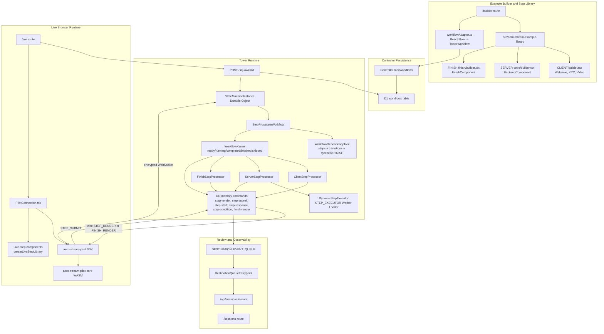
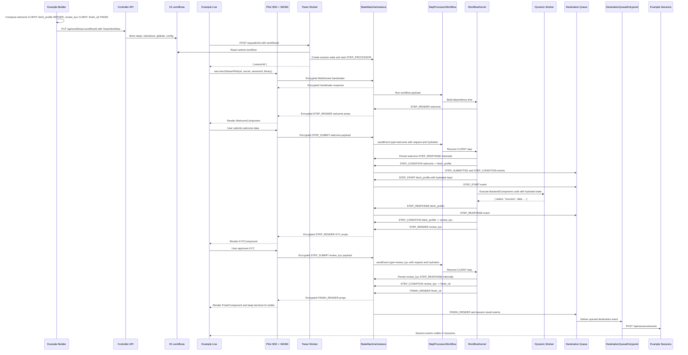

# ASTREAM-0004 Step Runtime Flow Architecture

## Decision

Document the step architecture as a human-readable map that connects the Example Builder, Controller workflow storage, Tower runtime, Pilot SDK, Dynamic Worker execution, and Sessions event review.

The runtime supports three workflow execution modes:

- `CLIENT`: Tower renders a step in the browser through Pilot and waits for the user or host component to submit data.
- `SERVER`: Tower runs dynamic TypeScript step code through the step executor and records the backend result.
- `FINISH`: Tower renders the terminal browser UI, closes the frontend pipe, and finalizes the session.

The Example app owns the human-facing step library. Tower owns runtime execution. Pilot owns encrypted browser communication and host component rendering. Controller owns durable workflow persistence.

## Step Type Responsibilities

| Execution mode | Example authoring owner | Tower runtime owner | Who responds | Data sent forward | Browser render | Destination events |
|---|---|---|---|---|---|---|
| `CLIENT` | `src/aero-stream-example-library/steps/*/builder.tsx` and `live.tsx` | `ClientStepProcessor` | Browser user or host component through Pilot `submit` | `STEP_SUBMIT` payload becomes the step result and can hydrate later steps | `STEP_RENDER` | `STEP_RENDERED`, `STEP_SUBMITTED`, `STEP_CONDITION` |
| `SERVER` | Backend step metadata and default code in `steps/code/builder.tsx` | `ServerStepProcessor` and `DynamicStepExecutor` | Dynamic Worker code | Normalized `{ status, data }` result becomes the step result and can hydrate later steps | No | `STEP_START`, `STEP_RESPONSE`, `STEP_CONDITION` |
| `FINISH` | Finish step metadata in `steps/finish/builder.tsx` and terminal component in `steps/finish/live.tsx` | `FinishStepProcessor` | Tower runtime | Terminal result finalizes the session | `FINISH_RENDER` | `FINISH_RENDER`, session close/result events |

`WorkflowDependencyTree` also creates a synthetic `FINISH` node named `__aero_stream_workflow_finish__`. It depends on all `CLIENT` await steps and explicit `FINISH` steps so Tower can close the frontend flow even when no explicit finish node is selected.

## Step Structure Diagram

## Simulated Workflow

This workflow includes one step of each execution mode:

| Step ID | Execution mode | Execution type | Responder | Example payload/result |
|---|---|---|---|---|
| `welcome` | `CLIENT` | `WelcomeComponent` | Browser user through the Welcome component | `{ status: "ready" }` |
| `fetch_profile` | `SERVER` | `BackendComponent` | Dynamic Worker code | `{ status: "success", data: { requestId: "REQ-1" } }` |
| `review_kyc` | `CLIENT` | `KYCComponent` | Browser user through the KYC component | `{ status: "approved", documentType: "passport" }` |
| `finish_ok` | `FINISH` | `FinishComponent` | Tower runtime | `{ status: "finished" }` |

The workflow model sent to Controller has:

- `start: "welcome"`.
- `welcome.transitions: [{ condition: true, next: "fetch_profile" }]`.
- `fetch_profile.transitions: [{ condition: { "==": [{ "var": "{{steps.fetch_profile.result.status}}" }, "success"] }, next: "review_kyc" }]`.
- `review_kyc.transitions: [{ condition: true, next: "finish_ok" }]`.
- `finish_ok.execution.mode: "FINISH"` and no outgoing transitions.

## Simulated Step Flow

## Data Handoff Rules

| Segment | Payload shape | Owner | Notes |
|---|---|---|---|
| Builder to Controller | `TowerWorkflow` with `start`, `steps`, `globals`, and `config` | Example Builder and Controller | `workflowAdapter.ts` converts React Flow nodes/edges into Tower runtime JSON. |
| Controller to Tower | D1 workflow row mapped to `WorkflowState` | Controller writes, Tower reads | Tower requires compatible `steps`, `execution`, `props`, `code`, `transitions`, and `config`. |
| Tower to Pilot | Encrypted `WireEmitterEvent` | Tower and Pilot | Internal fields such as `connection` and `internal.step` are stripped before encryption. |
| Pilot to Tower | Encrypted `ListenerEvent` | Pilot and Tower | `STEP_SUBMIT` includes `stepId`, optional `action`, and `payload`. |
| Workflow to DO | Internal emitter command fetch | Tower Workflow | `StateMachineWorkflowClient` sends `STEP_RENDER`, `STEP_START`, `STEP_RESPONSE`, `STEP_CONDITION`, and `FINISH_RENDER` to the DO. |
| DO to Workflow | Cloudflare Workflow event | Tower Durable Object | `step-submit.ts` claims the pending submit, stores the request, gathers hydration, and calls `STEP_PROCESSOR.sendEvent`. |
| DO to destinations | `DestinationEvent` queue message | Tower Durable Object and Queue handler | Destination events are observability outputs; they do not drive runtime progression. |

## Who Answers Each Runtime Question

| Question | Answering component | Reason |
|---|---|---|
| Which step can start now? | `WorkflowDependencyTree.readyStepIds` and `WorkflowKernel` | They track dependencies, selected transitions, completed nodes, blocked nodes, skipped nodes, and running nodes. |
| Which transition is selected? | `WorkflowKernel.selectTransitionEdges` | It evaluates non-default JSON Logic first and falls back to `condition: true` transitions. |
| What does a CLIENT step display? | `ClientStepProcessor` plus Example Live component library | Tower hydrates props and Pilot resolves `execution.type` to a host component. |
| Who submits CLIENT data? | Browser user or host component through Pilot | Pilot sends encrypted `STEP_SUBMIT`; Tower accepts it only from the active master connection and an active pending submit. |
| What does a SERVER step return? | Dynamic Worker code through `DynamicStepExecutor` | Tower passes hydrated context only; Dynamic Workers do not receive Tower bindings. |
| How are SERVER results exposed later? | `step-response.ts` and hydration state | Results are stored under the step key and exposed as `steps.<stepId>.result`. |
| Who closes the frontend? | `FinishStepProcessor` or synthetic FINISH path | Tower sends `FINISH_RENDER` or `CLOSED` and finalizes the session result. |
| Who records session history? | Tower destination events and Example Sessions API | Queue delivery posts events to `/api/sessions/events`; Sessions reads local process memory. |

## Placement Rules For Step Changes

| Change | Put it here | Do not put it here |
|---|---|---|
| New example CLIENT step UI | `src/aero-stream-example-library/steps/<step>/builder.tsx` and `live.tsx` | `src/features/live/components/implement/PilotConnection.tsx` |
| New SERVER step template | `src/aero-stream-example-library/steps/code/builder.tsx` or a new step library folder | Tower runtime processors |
| New runtime execution mode | Tower `runtime/workflow/workflow.model.ts`, `workflow/processors`, `workflow-kernel.ts`, tests | Example feature pages |
| New dependency or transition behavior | Tower `workflow/graph/workflow-dependency-tree.ts` and `workflow-kernel.ts` | Example workflow adapter only |
| New destination event shape | Tower `src/destination/destination-event.ts`, `payloads/*`, and emitter command | Pilot components |
| New Sessions rendering of an existing event | Example `src/features/sessions` and `src/lib/sessions` | Tower event emitters |

## Validation

Use these checks after step architecture changes:

- `cd aero-stream-example && yarn architecture:check`
- `cd aero-stream-example && yarn test`
- `cd aero-stream/apps/aero-stream-tower && yarn architecture:check`
- `cd aero-stream/apps/aero-stream-tower && yarn test`
- Manual flow: save the simulated workflow, start a session, complete both browser steps, verify the backend step emits `STEP_START` and `STEP_RESPONSE`, and confirm `/sessions` receives the timeline.
